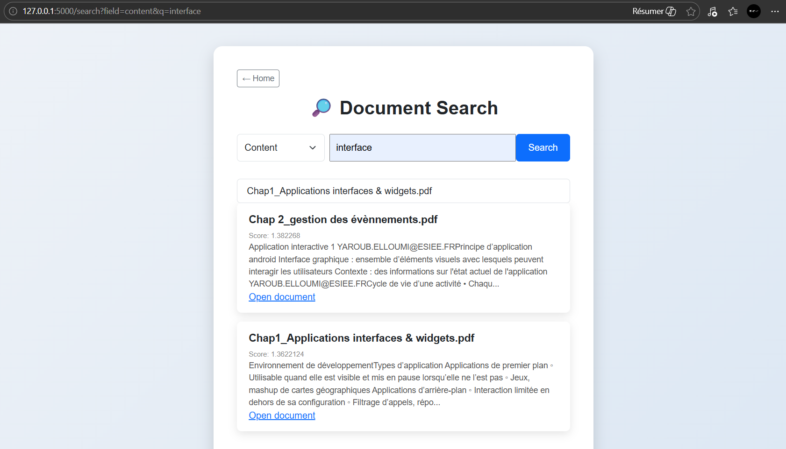
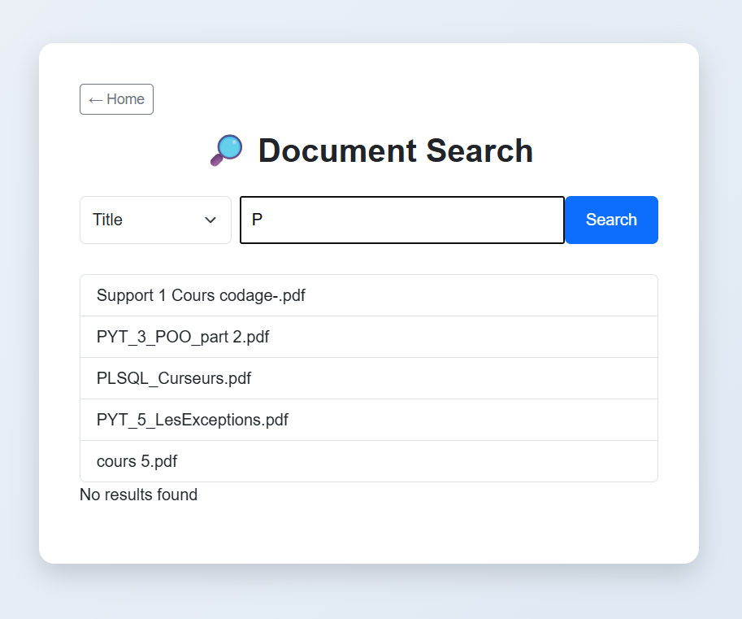

# Document Search Web App

Une application web pour rechercher et consulter des documents PDF, Word et Excel, utilisant **Flask** pour le backend et **Apache Solr** pour l’indexation et la recherche.

## Aperçu du projet

---

## Fonctionnalités

- Upload de documents (`PDF`, `DOCX`, `XLSX`) via une interface web.
- Extraction automatique du contenu texte pour indexation dans **Solr**.
- Indexation des documents dans Apache Solr avec stockage des champs (title, content, file_path, etc.).
- Recherche textuelle basée sur plusieurs champs (title et content) avec pondération (boost sur le title).
- Classement des résultats selon le score de pertinence fourni par Solr.
- Suggestions automatiques de recherche (autocomplete).
- Visualisation des résultats avec aperçu du contenu et lien pour ouvrir le fichier.
- Gestion simple des fichiers uploadés depuis le dossier `uploads/`.
- Création automatique du dossier uploads si nécessaire.
- Commit automatique dans Solr après chaque upload pour indexation immédiate.
- Navigation par sélection du champ de recherche (faceted search).
- Interface de visualisation des résultats avec :
  - aperçu du contenu extrait
  - affichage du score
  - lien permettant d’ouvrir le document original

# Aperçu de l'Autocomplete

---

## Structure du projet
flask-solr-search/
│
├── app.py # Application Flask principale
├── templates/ # Templates HTML (index.html, search.html)
├── uploads/ # Documents uploadés
└── README.md # Ce fichier

# Guide de Configuration et Démarrage

## 1. Configuration et démarrage de Solr

### Télécharger et extraire Solr
* Version : Apache Solr 9.10.1
* Extrayez l'archive dans votre dossier habituel.

### Démarrer Solr
Ouvrez votre terminal et entrez les commandes suivantes :
cd C:\Users\Lenovo\Downloads\solr-9.10.1\solr-9.10.1\bin
solr start

### Pour arrêter Solr
solr stop

---

## 2. Lancer l’application Flask

Assurez-vous que Solr est démarré.

### Exécuter Flask
python app.py

### Accéder à l’application
Lien local : http://127.0.0.1:5000
